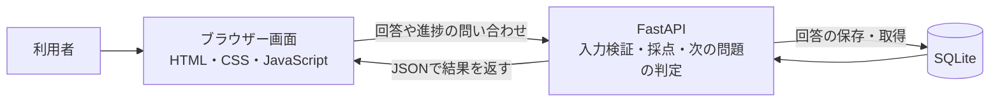

# StudyFlow QA Lab：日本語技術ガイド

StudyFlowは、2問のクイズに答えて、進捗と点数を保存する小さな学習Webアプリです。このリポジトリでは、品質リスクに基づくテスト設計、不具合の防止策、回帰テストと実行結果を管理しています。

## アプリでできること

1. ユーザー名を入力して学習画面を開く。
2. 3つの選択肢から回答し、2問のクイズを進める。
3. 回答済みの問題数と正解数を表示する。
4. 保存済みの回答をもとに、次の未回答問題から続ける。
5. 全問終了後に最終点数を表示する。

ユーザー名の入力は、デモ用の利用者識別です。パスワードや本人確認のある認証ではありません。

## 仕組み：画面・API・保存先の役割



| ファイル | 役割 | 説明のポイント |
|---|---|---|
| [app/static/index.html](app/static/index.html) | 画面の構造 | 名前入力、問題、進捗、完了画面を置く |
| [app/static/app.js](app/static/app.js) | ブラウザーの動作 | APIを呼び、選択肢や進捗を更新する。送信直後にボタンを無効にする |
| [app/main.py](app/main.py) | API | 入力を検証し、正誤を判定し、回答保存や続きの問題を返す |
| [app/db.py](app/db.py) | データ保存 | SQLiteに回答を保存し、進捗・点数を集計する |
| [tests/api/test_api.py](tests/api/test_api.py) | APIとDBのテスト | FastAPIの実装と実際のテスト用SQLiteを確認する |
| [tests/e2e/test_ui.py](tests/e2e/test_ui.py) | ブラウザーUIのテスト | Chromiumで画面を操作する。API応答はモックに置き換える |
| [.github/workflows/playwright.yml](.github/workflows/playwright.yml) | CI | pushとpull requestをきっかけにテストを実行する |

例えば正解を送ると、APIが正誤を判定し、SQLiteに回答を保存します。その後、保存された回答から点数と進捗を集計し、画面に返します。

進捗は回答行の総数ではなく、回答した問題IDの種類数で数えます。同じ問題に複数行があっても、進捗と点数の集計には最初の回答を使います。

## QAで何を優先しているか

| リスク | 利用者への影響 | 確認する内容 |
|---|---|---|
| 学習履歴が消える | 学習をやり直す必要がある | 回答がDBに保存され、続きの判定に使われるか |
| 点数が間違う | 学習結果を誤って伝える | 正解だけが加点され、DBの回答と点数が一致するか |
| 回答が二重に保存される | データが重複する | 同じ送信IDを再送しても2件目が保存されないか |
| 続きから再開できない | 学習を継続できない | 次の未回答問題が返り、画面に表示されるか |
| エラーの説明が分かりにくい | 次に何をすればよいか迷う | 空の名前に入力案内が出るか、不明な問題が404になるか |

QAの優先順位は「見た目の目立ちやすさ」だけでなく、利用者への影響とデータの正しさで決めています。リスクは[品質リスク分析](docs/QUALITY_RISK_ANALYSIS.md)、期待する結果は[受入条件](docs/ACCEPTANCE_CRITERIA.md)に整理されています。

## 14件の自動テストは何を確認するか

### API・SQLite：8件

こちらは実装されたAPIをFastAPIのTestClientから呼び、専用のテストDBを使います。テストごとにDBを初期化し、状態が混ざるのを防ぎます。

| 番号 | 確認する内容 |
|---|---|
| 01 | ヘルスチェックが200と正常状態を返す |
| 02 | 名前ありの入力を受け付け、空の名前を拒否する |
| 03 | 問題の選択肢を返し、不明な問題IDには404を返す |
| 04 | 正解の回答が保存され、点数と進捗が増える |
| 05 | 不正解も保存されるが、点数は増えない |
| 06 | 同じ送信IDを2回送っても、重複は保存されない |
| 07 | 次の未回答問題を返し、全問終了を判定する |
| 08 | 点数とSQLiteの回答が一致し、DB読み取り後の接続が閉じられる |

### ブラウザーUI：6件

こちらはPlaywrightでChromiumを操作します。APIの代わりに、テスト内に用意した一定の応答を返す仕組み（モックAPI）を使います。

| 番号 | 確認する内容 |
|---|---|
| 09 | 名前を入力すると学習画面が開き、進捗0/2が表示される |
| 10 | 空の名前に入力を促すエラーが表示される |
| 11 | 回答後に進捗1/2と2問目が表示される |
| 12 | 既存の回答をモックに用意すると、2問目から再開する |
| 13 | 2問とも正解した後、最終点数2/2が表示される |
| 14 | 送信ボタンを素早く2回押しても、モック内の回答は1件になる |

**14件PASSは、8件のAPI・DB検証と6件のモックUI検証が通ったという意味です。** ブラウザーから実際に起動したAPIとDBまでをつなぐ統合E2Eの成功を意味しません。

[手動テスト設計](docs/TEST_CASES.md)には20シナリオがありますが、これは実行済みの20件PASSという記録ではありません。自動テストの実行結果とは区別しています。

## 二重送信の防止策

回答を1回送ったつもりでも、連打や再送で同じ要求が届くことがあります。画面のボタンだけに頼ると、APIを直接呼んだ場合の重複を防げません。

この実装には3つの対策があります。

1. 画面側で回答送信に`submission_id`（送信ID）を付ける。
2. SQLiteで`UNIQUE(username, submission_id)`を設定し、同じ利用者・同じ送信IDの重複を拒否する。
3. 画面側で送信直後にボタンを無効化する。

例えば、`alice`が送信ID`dup-1`で答えた後、同じIDで再送すると、APIは`recorded: false`、`status: duplicate`を返します。2件目の回答は保存されません。同じ要求を繰り返しても重複保存しない性質を、ここでは「冪等性」と呼びます。

この仕組みが保証するのは、**同じ利用者・同じ送信IDの重複防止**です。別の送信IDで同じ問題に答えた場合まで、DBのこの制約が拒否するわけではありません。

`BUG-002`の修正前のシナリオは、取り込んだ再構成資料に記載されたものです。元の修正前コードの失敗ログはこのリポジトリにありません。本リポジトリで検証しているのは、現在の防止策と回帰テストです。

詳しくは[不具合レポート](docs/BUG_REPORTS.md)と[回帰テスト報告](docs/REGRESSION_REPORT.md)を参照してください。

## 今回、実際に失敗から修正まで確認したこと

公開準備中のテストで、SQLite接続が閉じられていない警告が出ました。`with conn:`はトランザクションを処理しますが、それだけでは接続を閉じません。

既存の08番のテストに「DB読み取りが終わった後、その接続が閉じられていること」を確認する処理を追加すると、修正前には失敗しました。DB処理を`with closing(connect()) as conn, conn:`に変更し、処理終了時に接続が確実に閉じるようにしました。修正後は、この確認を含む14件がPASSしています。

## GitHub Actionsの実行結果

CIは、変更をリポジトリへ送ったときにテストを自動実行する仕組みです。このリポジトリでは次の順序で動きます。

1. Ubuntuの実行環境にソースを取得する。
2. Python 3.12と必要な依存パッケージを用意する。
3. Playwright用のChromiumを用意する。
4. API・SQLiteとブラウザーUIの14件を実行する。
5. JUnit形式の結果を`qa-test-results`という成果物に保存する。

[Actions一覧](https://github.com/advitionisland-island-it/studyflow-qa-portfolio/actions/workflows/playwright.yml)で、確認したいcommitと実行対象のSHAが同じかを見ます。READMEのバッジは`main`の状況を見る入口です。特定の変更の証拠には、その変更に対応する実行ページを使います。

初回公開commit `05c7d50`には、[14件PASSの実行記録](https://github.com/advitionisland-island-it/studyflow-qa-portfolio/actions/runs/37560826509)があります。これはそのcommitの記録であり、将来の変更まで保証するものではありません。

[公開準備の検証記録](evidence/PUBLICATION_VERIFICATION.json)には、ローカル14件PASS、Python側カバレッジ93.04%、その時点の依存監査と秘密情報パターン検査の結果を記録しています。93.04%はPythonの`app/`に対する実行カバレッジで、JavaScriptやシステム全体の検証率ではありません。

## 手元で試す方法

リポジトリのルートで実行します。

```bash
python3 -m venv .venv
source .venv/bin/activate
python -m pip install -r requirements.txt
python -m playwright install chromium
python -m pytest -q tests/api tests/e2e
```

画面を動かすときは次を実行し、`http://127.0.0.1:8000`を開きます。

```bash
python -m uvicorn app.main:app --reload
```

デモでは架空の名前とデータを使います。通常の起動時は`STUDYFLOW_TESTING`を未設定にします。`STUDYFLOW_TESTING=1`のときだけ、テスト用のDBリセットAPIが有効になります。

## 現在の限界

- ユーザー名を知っていれば、そのユーザーの進捗をAPIから取得できます。本番用の認証・認可はありません。
- ブラウザーと実APIを接続するE2E、実ブラウザーでの再読み込み後の永続化、DB再起動後の維持は、この14件だけでは確認していません。
- 負荷試験、侵入テスト、Docker検証、ミューテーションテストは、この公開テストの実績に含めません。
- 現在のブラウザーテストは画面動作の確認が中心です。画面デザインやモバイル表示の品質は保証しません。
- 依存監査と秘密情報パターン検査は、実施時点・検査対象に対する結果です。将来の脆弱性や、すべての秘密情報の不存在を保証しません。
